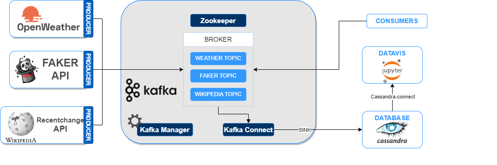

# How to Build a Distributed Big Data Pipeline Using Kafka, Cassandra, and Jupyter Lab with Docker

## Introduction

This project demonstrates how to build a distributed big data pipeline using Kafka, Cassandra, and Jupyter Lab with Docker. The pipeline processes data from three distinct sources: the OpenWeatherMap API, a custom Faker API with 10 fields, and the Wikipedia Recent Change API. By combining these diverse data streams, you can gain insights into real-time weather information, generate synthetic data, and monitor recent changes on Wikipedia.




## Tutorial videos


## Data Sources

### 1. OpenWeatherMap API

- **Link:** [OpenWeatherMap API](https://openweathermap.org/api)
- After obtaining the API keys, please update the files  "owm-producer/openweathermap_service.cfg" accordingly.
- **Description:** OpenWeatherMap provides a powerful and comprehensive weather API, offering real-time weather data for any location worldwide. The API includes information such as current weather conditions, forecasts, and historical data.
You need to apply for some APIs to use with this. The APIs might take days for application to be granted access. Sample API keys are given, but it can be blocked if too many users are running this.
#### Sample JSON
```
{
  "coord": {
    "lon": -73.9352,
    "lat": 40.7306
  },
  "weather": [
    {
      "id": 800,
      "main": "Clear",
      "description": "clear sky",
      "icon": "01n"
    }
  ],
  "base": "stations",
  "main": {
    "temp": 23.45,
    "feels_like": 16.78,
    "temp_min": 22.05,
    "temp_max": 24.86,
    "pressure": 1020,
    "humidity": 31
  },
  "visibility": 10000,
  "wind": {
    "speed": 2.68,
    "deg": 218,
    "gust": 2.83
  },
  "clouds": {
    "all": 0
  },
  "dt": 1640750154,
  "sys": {
    "type": 2,
    "id": 2038214,
    "country": "US",
    "sunrise": 1640693773,
    "sunset": 1640730054
  },
  "timezone": -18000,
  "id": 5128581,
  "name": "New York",
  "cod": 200
}
```
### 2. Faker API

- **Description:** This custom API is designed using the Faker library to generate synthetic data with 10 fields. Faker is a Python library that allows you to create realistic-looking fake data for testing and development purposes. The fields can include names, addresses, dates, and more, providing a diverse set of information for testing and analysis.

#### Sample JSON
```
{
  "name": "John Doe",
  "gender": "Male",
  "address": "123 Main St, Cityville, State, 12345",
  "year": 1990,
  "email": "john.doe@example.com",
  "phone_number": "+1234567890",
  "job": "Software Engineer",
  "company": "Tech Solutions Inc.",
  "country": "United States",
  "city": "Cityville",
  "date_time": "2023-12-08 15:30:00",
  "credit_card_number": "1234-5678-9012-3456"
}
```
### 3. Wikipedia Recent Change API

- **Link:** [Wikimedia Data Stream Recentchange](https://stream.wikimedia.org//v2/stream/recentchange)
- **Description:** The Wikimedia Data Stream Recentchange API provides real-time updates on the latest changes made to Wikipedia articles. The API includes essential information such as title, URL, language domain, timestamp, user name, user comment (reason for change), user is bot (here called "bot"), bot type (located user; not a new field!), type (edit, categorize, etc., unique to the endpoint), length (article length: old and new, unique to the endpoint), minor change (if it is a minor change).

#### Sample JSON

```json
"$schema":"/mediawiki/recentchange/1.0.0",
   "meta":{
      "uri":"https://commons.wikimedia.org/wiki/File:DESERT_SCIMITAR_130430-M-OC922-009.jpg",
      "request_id":"1b12bec3-c72e-4451-ae23-bc5742c51343",
      "id":"e195ebcf-e9ff-4179-9591-0d2384b96117",
      "dt":"2021-08-27T13:20:18Z",
      "domain":"commons.wikimedia.org",
      "stream":"mediawiki.recentchange",
      "topic":"codfw.mediawiki.recentchange",
      "partition":0,
      "offset":441362978
   },
   "id":1754327016,
   "type":"edit",
   "namespace":6,
   "title":"File:DESERT SCIMITAR 130430-M-OC922-009.jpg",
   "comment":"add location United States inside Taken On on template",
   "timestamp":1630070418,
   "user":"RudolphousBot",
   "bot":true,
   "minor":true,
   "patrolled":true,
   "length":{
      "old":1132,
      "new":1155
   },
   "revision":{
      "old":585514253,
      "new":586543834
   },
   "server_url":"https://commons.wikimedia.org",
   "server_name":"commons.wikimedia.org",
   "server_script_path":"/w",
   "wiki":"commonswiki",
   "parsedcomment":"add location United States inside Taken On on template"
```

# Setting Up the Project

#Create docker networks
```bash
$ docker network create kafka-network                         # create a new docker network for kafka cluster (zookeeper, broker, kafka-manager services, and kafka connect sink services)
$ docker network create cassandra-network                     # create a new docker network for cassandra. (kafka connect will exist on this network as well in addition to kafka-network)
```
## Starting Cassandra

Cassandra is setup so it runs keyspace and schema creation scripts at first setup so it is ready to use.
```bash
$ docker-compose -f cassandra/docker-compose.yml up -d
```

## Starting Kafka on Docker
```bash
$ docker-compose -f kafka/docker-compose.yml up -d            # start single zookeeper, broker, kafka-manager and kafka-connect services
$ docker ps -a                                                # sanity check to make sure services are up: kafka_broker_1, kafka-manager, zookeeper, kafka-connect service
```

> **Note:** 
Kafka-Manager front end is available at http://localhost:9000

You can use it to create cluster to view the topics streaming in Kafka.


IMPORTANT: There is a bug that I don't know how to fix yet. You have to manually go to CLI of the "kafka-connect" container and run the below comment to start the Cassandra sinks.
```
./start-and-wait.sh
```

## Starting Producers
```bash
$ docker-compose -f owm-producer/docker-compose.yml up -d     # start the producer that retrieves open weather map
$ docker-compose -f faker-producer/docker-compose.yml up -d # start the producer for twitter
$ docker-compose -f wikipedia-producer/docker-compose.yml up -d # start the producer for twitter
```

## Starting Consumer classifier (plus Weather consumer)

There is another catch: We cannot build the Docker file for the consumer directly with the docker-compose.yml (We can do so with all other yml files, just not this one -.-). So we have to manually go inside the folder "consumers" to build the Docker using command:

```bash
$ docker build -t consumer .        # start the consumers
```

Then go back up 1 level with "cd .." and we can start consumers:
```bash
$ docker-compose -f consumers/docker-compose.yml up       # start the consumers
```

## Check that data is arriving to Cassandra

First login into Cassandra's container with the following command or open a new CLI from Docker Desktop if you use that.
```bash
$ docker exec -it cassandra bash
```
Once loged in, bring up cqlsh with this command and query fakerdata, wikipediadata and weatherreport tables like this:
```bash
$ cqlsh --cqlversion=3.4.4 127.0.0.1 #make sure you use the correct cqlversion

cqlsh> use kafkapipeline; #keyspace name

cqlsh:kafkapipeline> select * from weatherreport;

cqlsh:kafkapipeline> select * from fakerdata;

cqlsh:kafkapipeline> select * from wikipediadata;
```

And that's it! you should be seeing records coming in to Cassandra. Feel free to play around with it by bringing down containers and then up again to see the magic of fault tolerance!


## Visualization

Run the following command the go to http://localhost:8888 and run the visualization notebook accordingly

```
docker-compose -f data-vis/docker-compose.yml up -d
```

## Teardown

To stop all running kakfa cluster services

```bash
$ docker-compose -f data-vis/docker-compose.yml down # stop visualization node

$ docker-compose -f consumers/docker-compose.yml down          # stop the consumers

$ docker-compose -f owm-producer/docker-compose.yml down       # stop open weather map producer

$ docker-compose -f faker-producer/docker-compose.yml down   # stop faker producer

$ docker-compose -f wikipedia-producer/docker-compose.yml down   # stop wikipedia producer

$ docker-compose -f kafka/docker-compose.yml down              # stop zookeeper, broker, kafka-manager and kafka-connect services

$ docker-compose -f cassandra/docker-compose.yml down          # stop Cassandra
```

!IMPORTANT!: These commands are for your reference, please don't do it as we don't want to spend time downloading resources again in the next tutorial.

To remove the kafka-network network:

```bash
$ docker network rm kafka-network
$ docker network rm cassandra-network
```

To remove resources in Docker

```bash
$ docker container prune # remove stopped containers, done with the docker-compose down
$ docker volume prune # remove all dangling volumes (delete all data from your Kafka and Cassandra)
$ docker image prune -a # remove all images (help with rebuild images)
$ docker builder prune # remove all build cache (you have to pull data again in the next build)
$ docker system prune -a # basically remove everything
```


